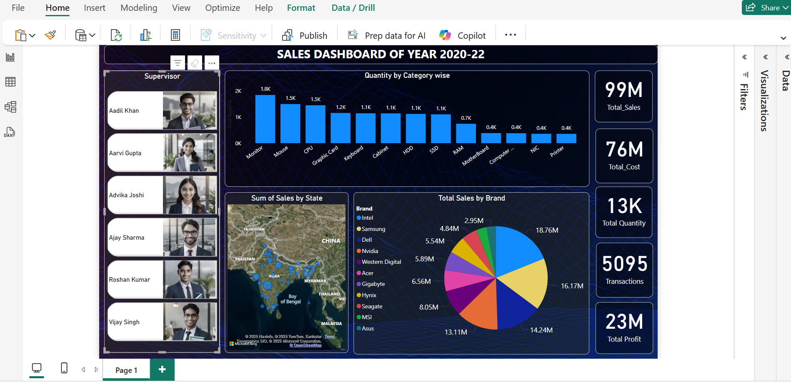

# 📊 # PowerBI-Sales-Dashboard-Techno

This repository contains a complete **end-to-end Business Intelligence solution** using Power BI. The project visualizes sales performance data from a tech company over the years 2020 to 2022, with dynamic insights by **product category, brand, region, and supervisor**.

---

## 📁 Project Contents

- `Complete_Techno_Sales_Data-2.xlsx` – Raw dataset used in Power BI
- `Techno_Sales_Dashboard.pbix` – Power BI dashboard file
- `dashboard_screenshot.png` – Screenshot of the final dashboard
- `README.md` – This documentation

---

## 💡 Project Objective

To create an interactive and insightful sales dashboard that helps stakeholders:
- Analyze sales trends by **brand**, **category**, and **state**
- View KPIs such as **Total Sales, Profit, Quantity, and Transactions**
- Filter performance **by each Supervisor** (drill-down analysis)
- Identify top-performing products and regions

---

## 🧰 Tools & Skills Used

- **Power BI Desktop**
- **Power Query** for data cleaning & transformation
- **Data Modeling** with relationships and calculated columns
- **DAX** for KPI metrics
- **Maps, Pie Charts, Bar Charts**, and **Slicers** for data visualization

---

## 📌 Key Features

- Supervisor-level drill-through (select any supervisor to filter all visuals)
- KPI Cards: Total Sales (99M), Total Profit (23M), etc.
- Map showing regional distribution of sales
- Brand-level pie chart to highlight revenue share
- Category-wise quantity bar chart
- Clean, modern, and business-ready layout

---

## 📸 Dashboard Preview

---

## 📂 Folder Structure
📁 PowerBI-Sales-Dashboard-Techno

┣ 📊 Techno_Sales_Dashboard.pbix

┣ 📈 Complete_Techno_Sales_Data.xlsx

┣ 🖼️ dashboard_screenshot.png

┗ 📄 README.md

---

## 🧠 Learnings

This project helped reinforce real-world BI techniques including:
- End-to-end pipeline: Load → Transform → Model → Visualize
- Dynamic user interactivity (drill-through filtering)
- Business KPI communication through storytelling visuals

---
## 🙋‍♂️ Contact

📬 [Your Name] – [Your LinkedIn Profile]  
🔗 [Your Portfolio or GitHub Profile]

---

## 🌟 If you like this project, please consider giving it a ⭐ on GitHub!
